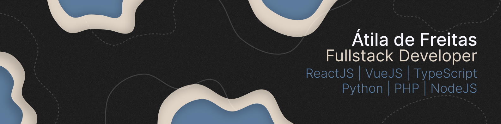

# Gaio Web - The **AI** Website Generator

> THIS REPOSITORY WILL BE PRIVATED AFTER EVALUATION BY LAUNCHCODE

> FOR SECURITY REASONS AND TO PRESERVE THE COMPANY, THE .env WILL NOT BE MADE AVAILABLE

> I prepared a _.json_ file with mock data so that I can run the project locally.

## About the project 🐦

The Gaio Web project emerged from the ideas of [Bernardo Rodela](https://www.linkedin.com/in/bernardo-rodela-a14b49193/) and [Marcos Varotti](https://www.linkedin.com/in/marcosvarottifilho/), and in February 2023 they found me to get the idea off the ground.

Gaio was born to solve the pain of those who want to have a professional website but don't have time and don't want to spend a lot on designers and programmers.

With half a dozen messages exchanged with our Bot via WhatsApp, in less than 5 minutes you will have a unique website in the palm of your hand. And for just BRL 30,00 per month you can customize it to make it your own. In addition to the incredible possibility of bringing your domain.

Gaio generated more than **15.000** websites in 7 months of projects, and transformed the lives of hundreds of professionals by allowing them to position themselves digitally.

## Achievements 🏆

After having created 10 thousand websites, we joined [Microsoft for Startups](https://www.microsoft.com/en-us/startups) and were awarded **USD 150.000,00** in Microsft services (OpenAI credits, MongoDB, Azure)

## Built With

- [ReactJS](https://react.dev/) with [Typescript](https://www.typescriptlang.org/)
- [NodeJS](https://nodejs.org/en)
- [MongoDB](https://www.mongodb.com/)
- Frontend deployed at [Netlify](https://www.netlify.com/)
- Backend deployed at [Render](https://render.com/)
- [ChatGPT](https://chat.openai.com/)
- [Firebase](https://firebase.google.com/)
- [Unsplash](https://unsplash.com/)
- [ManyChat](https://manychat.com/)

## How it works? ⚙️

Our ChatBot was built using the low-code automation platform called ManyChat. For our website generator to work well, we divided all the creation steps into 6 questions:

- What is the name of your company?
- Tell us a little about your products or services.
- What is the category of your company?
- Tell a little about the history of what you or your company does.
- Now let's look at the differentiators, which make a person choose you and not a competitor.
- Name the second difference you thought of. (Try to use a maximum of 3-5 words)
- Name the third difference you thought of. (Try to use a maximum of 3-5 words)

With this, ManyChat stores the answers to each question and makes a request to our API.

Our API receives the content of the answered question and inserts it into a robust prompt to be sent to ChatGPT, which will return the text that will be stored in MongoDB. ChatGPT also generates tags for each site, which we send to the Unsplash API to return unique images that reference the business model of that specific site.

As users's initial contact is via WhatsApp, we find it more practical to deal with their mobile phone numbers as the user's primary ID.

After paying the BRL 30,00 fee, you will have access to the editing form, where all information on the website can be edited by you, as follows:

- Change the titles and texts of each session;
- Change photos;
- Hide sessions;
- Hide session buttons;
- Change button texts;
- Add social media;
- Submit logo;
- Change color palette;
- etc.

---

# ▶️ [Demonstration video](https://youtu.be/gXhPfx4mkTM)

## Getting Started

### Frontend:

#### Installation:

```sh
cd Front && npm install
```

#### Running:

```sh
npm run dev
```

### Backend:

#### Installation:

```sh
cd Api && npm install
```

#### Running:

```sh
npn run dev
```

---

<div align="center">


</br>
</br>
<p align="center">
<a href="https://www.linkedin.com/in/atilafreitas/"></a>
    &nbsp;
    <a href="https://t.me/atilajcfreitas"></a>
    &nbsp;
    <a href="mailto:contact@atiladefreitas.com"></a>
    &nbsp;
    <a href="https://github.com/atiladefreitas"></a>
</p>
</div>
